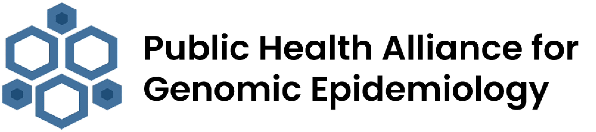

### Wastewater Surveillance Guidance and Resources

Overview
========
This repository hosts guidance documents and resources developed by the [PHA4GE](https://pha4ge.org/) Wastewater Surveillance Working Group. These documents address core challenges involved in designing effective wastewater surveillance strategies, analysis of wastewater pathogen sequencing and quantification data, and for sharing of this data with the global public health community. 

As the wastewater surveillance field rapidly progresses, it can be difficult to keep track of the current state-of-the-art methods and consensus practices. Our working group seeks to provide fully open and up-to-date best practice standards and protocols for the wastewater surveillance community via this live document. We welcome suggestions from across the wastewater research and public health community, please see the [Contributing](#contributing) section below for more information on how to contribute. 

## Current guidance documents 
- [Surveillance Strategies](guidance_docs/SurveillanceStrategies-GuidanceDoc.md)
- [Data Analysis](guidance_docs/DataAnalysis-GuidanceDoc.md)
- [Data Sharing](guidance_docs/DataSharing-GuidanceDoc.md)
- [Ethics and Legality (coming soon)](.)

Contributing
============
These documents are intended as a live, open community resource and contributions to the documents are more than welcome. To propose a change, edit the source files and open a pull-request with the proposed changes.

If you're interested in becoming part of our group please free to join as a member of [PHA4GE](https://pha4ge.org/about/). Our working group meets bi-weekly on Thursdays. 